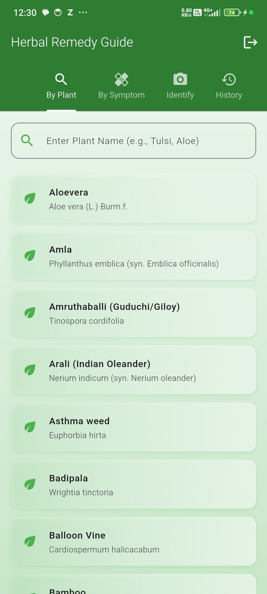
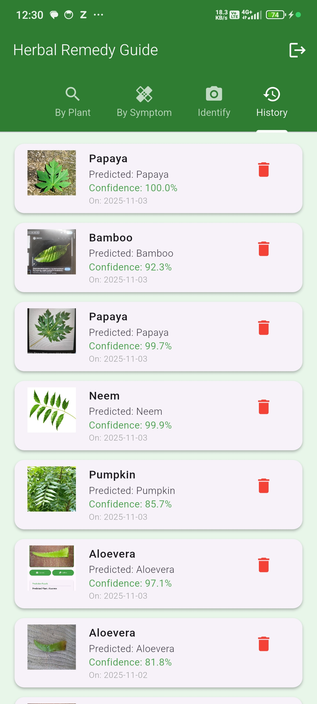
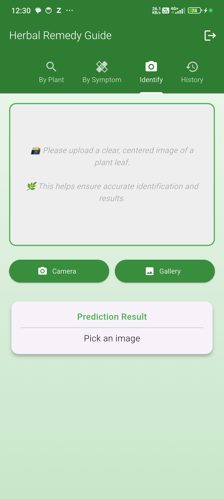
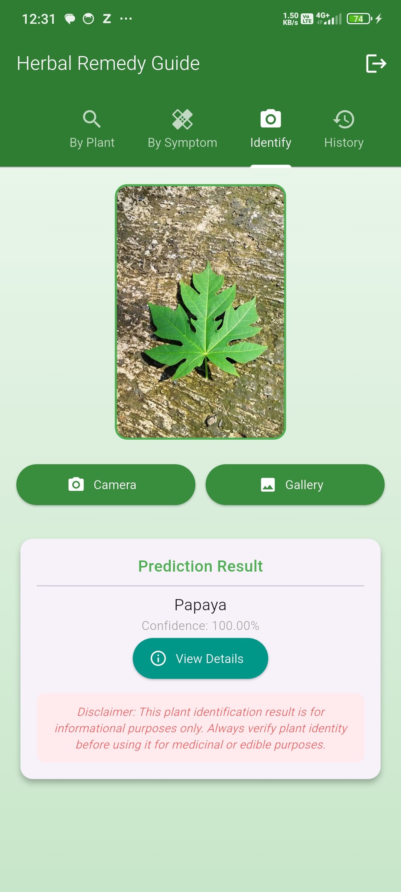
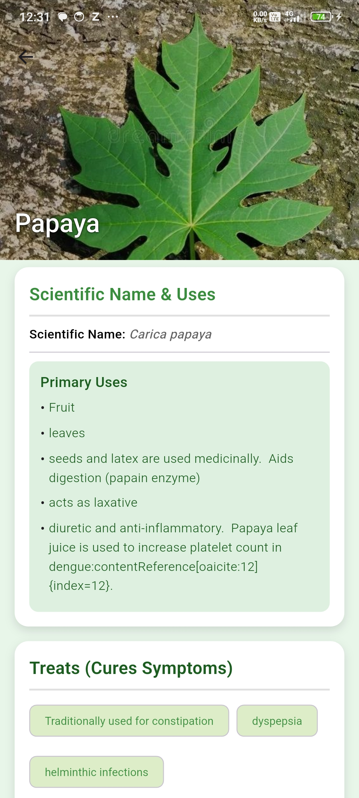
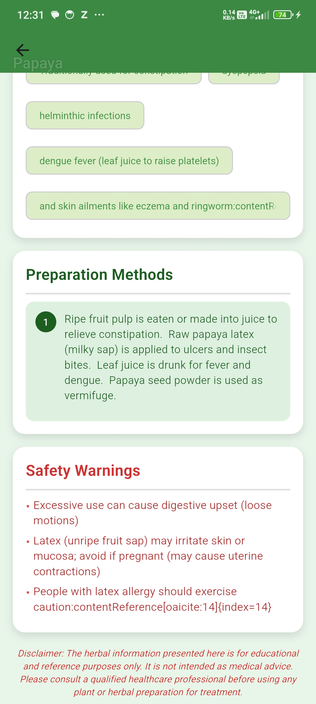
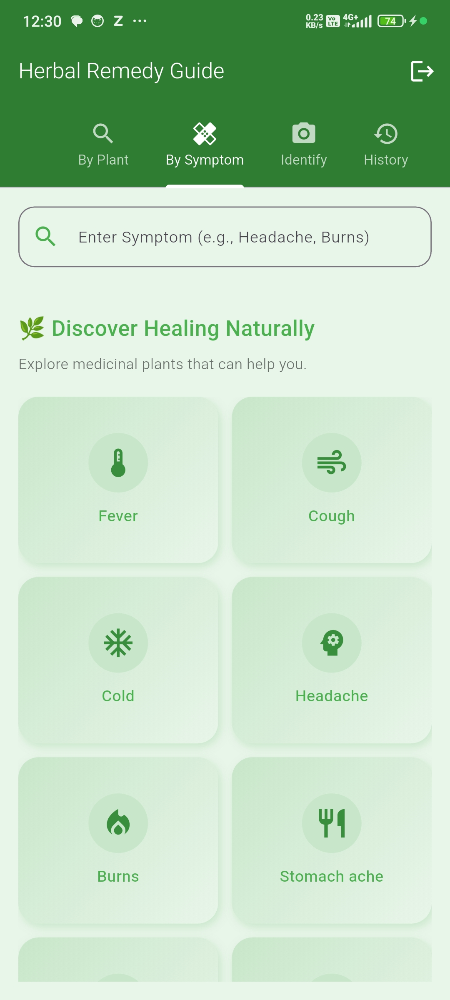
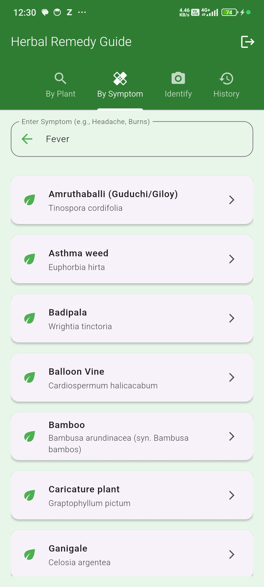
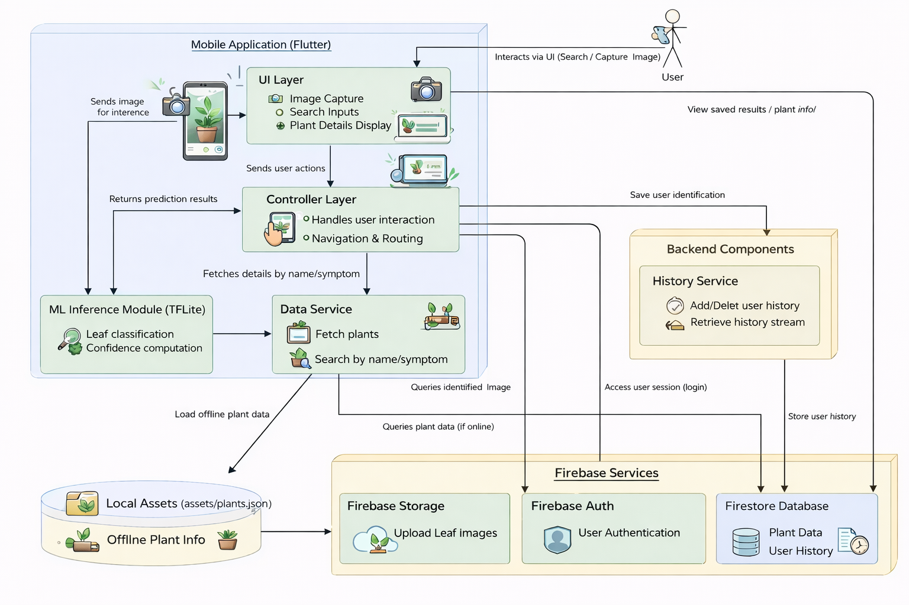

<div align="center">

# 🌿 HerbalRx

### Herbal RX: Herbal Remedy Extraction and Recommendation Using Deep Learning and Image Processing

Identify medicinal plants using Deep Learning and TensorFlow Lite, explore their medicinal properties, search remedies by symptoms, and securely maintain prediction history using Firebase.


</div>

---

# 📖 Overview

**HerbalRx** is a cross-platform Flutter application that identifies medicinal plants from leaf images using a TensorFlow Lite deep learning model. After identification, the application provides medicinal uses, preparation methods, symptoms treated, safety precautions, and scientific information.

The application also supports searching medicinal plants by plant name or symptoms and securely stores user prediction history using Firebase Authentication and Cloud Firestore.

---

# 🚀 Highlights

- 📷 Camera and Gallery image support
- 🔍 Search medicinal plants by plant name
- ❤️ Search medicinal plants by symptoms
- 🔊 Text-to-Speech support
- 📚 Detailed medicinal information
- ⚠ Safety warnings and precautions
- 📜 Preparation methods
- 📈 AI confidence score
- ☁ Firebase Authentication
- 🔥 Firestore prediction history
- 📱 Beautiful Material Design interface

---

# ✨ Features

| Feature | Description |
|----------|-------------|
| 🌿 Plant Identification | Identifies medicinal plants using TensorFlow Lite |
| 📷 Image Capture | Supports Camera and Gallery |
| 🔍 Plant Search | Search medicinal plants by name |
| ❤️ Symptom Search | Discover plants based on symptoms |
| 📚 Plant Details | Scientific name, medicinal uses, treatments and preparation methods |
| 🔊 Voice Assistant | Reads prediction and plant details using Text-to-Speech |
| 📈 Confidence Score | Displays prediction confidence |
| ☁ Firebase | Authentication and prediction history |
| 📱 Flutter UI | Modern, responsive and user-friendly interface |

---

# 📱 Application Screens

## 🔐 Authentication

| Login | Signup |
|-------|--------|
|  |  |

---

## 🌿 Search by Plant Name

| Plant Search | Prediction History |
|--------------|-------------------|
|  |  |

---

## 🤖 AI Plant Identification

| Before Prediction | Prediction Result |
|------------------|-------------------|
|  |  |

---

## 📚 Plant Information

| Scientific Information | Preparation & Safety |
|------------------------|----------------------|
|  |  |

---

## ❤️ Search by Symptoms

| Symptom Search | Search Results |
|---------------|----------------|
|  |  |

---

# 🏗 System Architecture

<p align="center">

</p>

### Workflow

```
User
   │
   ▼
Flutter Mobile Application
   │
   ├── Search by Plant
   ├── Search by Symptom
   └── Capture Leaf Image
            │
            ▼
 TensorFlow Lite Model
            │
            ▼
  Plant Prediction
            │
            ▼
Retrieve Plant Details
(Local JSON Dataset)
            │
            ▼
Display Information
            │
            ▼
Store History in Firebase
```

---

# 🤖 Machine Learning

| Property | Value |
|----------|-------|
| Model | TensorFlow Lite |
| Framework | TensorFlow |
| Dataset | Medicinal Plant Leaf Dataset |
| Classes | 80 Plant Species |
| Input Size | 224 × 224 |
| Output | Plant Name + Confidence Score |
| Inference | On-device (Offline) |

---

# 🛠 Technology Stack

| Category | Technology |
|-----------|------------|
| Mobile Framework | Flutter |
| Programming Language | Dart |
| Machine Learning | TensorFlow Lite |
| Authentication | Firebase Authentication |
| Database | Cloud Firestore |
| Cloud Storage | Firebase Storage |
| Offline Dataset | JSON |
| IDE | Android Studio / VS Code |

---

# 📂 Project Structure

```text
lib/
│
├── models/
├── screens/
├── services/
├── widgets/
├── utils/
│
assets/
│
├── images/
├── ml_model/
├── medicinal_plants_data.json
│
android/
ios/
```

---

# 🚀 Installation

Clone the repository

```bash
git clone https://github.com/Harishit-123/HerbalRx.git
```

Go to project

```bash
cd HerbalRx
```

Install packages

```bash
flutter pub get
```

Run the application

```bash
flutter run
```

---

# 📊 Dataset

- Medicinal Plant Leaf Image Dataset
- 80 Plant Classes
- Local JSON dataset for offline medicinal information
- TensorFlow Lite model for mobile inference

---

# 📈 Project Statistics

| Metric | Value |
|---------|-------|
| Platform | Android |
| Framework | Flutter |
| Programming Language | Dart |
| ML Framework | TensorFlow Lite |
| Plant Classes | 80 |
| Offline Support | ✅ |
| Firebase Authentication | ✅ |
| Firestore Database | ✅ |
| Firebase Storage | ✅ |
| Text-to-Speech | ✅ |

---

# 🔮 Future Enhancements

- integration of Explainable AI features such as Grad-CAM or visual heatmaps. 
- expanding the model to recognize various plant parts such as flowers, stems, bark, and fruits 
- live camera-based detection with bounding boxes

---

# 👨‍💻 Developer

## Harishit

B.Tech Student |AI & Machine Learning Enthusiast

### Connect with me

GitHub: https://github.com/Harishit-123

---

# 📄 License

This project was developed as an academic major project for educational and research purposes. It demonstrates the integration of Deep Learning, Flutter, TensorFlow Lite, and Firebase for medicinal plant identification and herbal remedy recommendation.

---

<div align="center">

⭐ If you found this project useful, consider giving it a star!

</div>